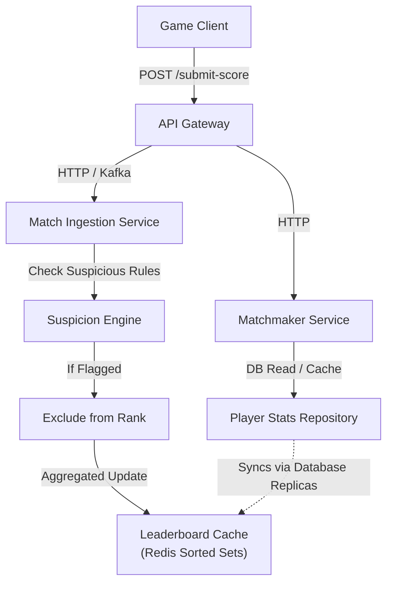
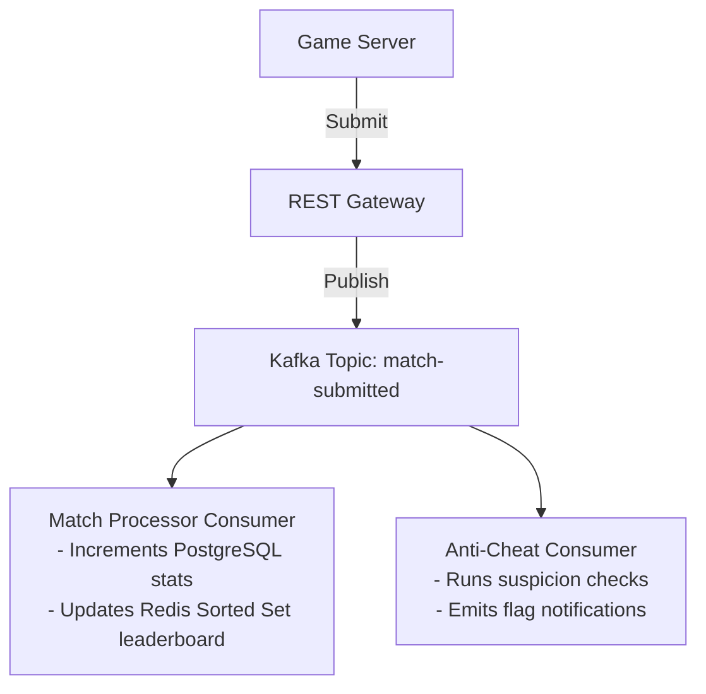

# Game Operations System Design Document

**Project Name**: Tech Brain of Multiplayer Game Event  
**Target Event Volume**: 200,000+ active players submitting matches concurrently.  
**System Architecture Paradigm**: Microservices-oriented, Event-driven, Cache-accelerated.  

---

## 1. Problem Understanding & Objective

During high-concurrency weekend events, online multiplayer game backends suffer from three major operational challenges:
1. **Leaderboard Integrity**: Preventing cheaters and malicious score injection from ruining the competitive experience.
2. **Matchmaking Fairness**: Grouping players together under tight latency (ping) brackets and tight competitive skill brackets to avoid poor user experiences.
3. **Write-Heavy Ingestion**: Handling thousands of match submissions per second without slowing down database read operations.

This Game Ops System is designed to ingest matches, process suspicious scores instantly, aggregate player stats, provide real-time global/regional leaderboards, and run a latency-aware skill matchmaker.

---

## 2. System Architecture Overview



### Components:
*   **Match Ingestion Service**: Exposes high-throughput REST endpoints to receive match summaries.
*   **Suspicion Engine**: A rule-based scoring module evaluating abnormal speed, kill ratios, latency issues, and historical inconsistencies.
*   **Leaderboard Service**: Dynamically aggregates event performance, utilizing a PostgreSQL relational backend for durable tracking and Redis for sub-millisecond ranking queries.
*   **Matchmaking Service**: Groups queued players using a localized latency-bucket algorithm layered with skill ratings.

---

## 3. Database Schema

The database schema is fully compliant with **PostgreSQL** (including cloud PostgreSQL instances like **NeonDB**). The application supports Spring Profiles (`local` for local PostgreSQL and `neon` for Cloud NeonDB) to enable direct connection configuration without environment variables. The automated test suite utilizes an isolated in-memory **H2** database schema for local speed and self-containment.

```
                    MatchResult [1]  --------  [0..*] PlayerStats
                    (Raw Matches)                      (Aggregated Summaries)
                    - id (PK, BigInt)                  - playerId (PK, Varchar)
                    - playerId (Varchar)               - region (Varchar)
                    - matchId (Varchar)                - totalMatches (Int)
                    - region (Varchar)                 - totalScore (Int)
                    - device (Varchar)                 - avgPing (Double)
                    - ping (Int)                       - avgKills (Double)
                    - score (Int)                      - avgDeaths (Double)
                    - kills (Int)                      - skillRating (Int)
                    - deaths (Int)                     - isSuspicious (Boolean)
                    - matchDurationSeconds (Int)       - seasonId (Int)
                    - createdAt (Timestamp)
```

### Database Performance Optimization:
1.  **Composite Index** on `PlayerStats(region, is_suspicious, total_score DESC, avg_deaths ASC)` to accelerate regional leaderboards.
2.  **Player ID Index** on `MatchResult(player_id)` to speed up historical outlier evaluation.

---

## 4. Leaderboard Design & Tie-Breaking

To reward consistent competitive effort, leaderboard positions are calculated as:
$$\text{Leaderboard Score} = \sum \text{Match Scores for Current Season}$$

### Tie-Breaking Hierarchy:
If two players have matching total scores:
1.  **Fewer Average Deaths**: Players who die less on average are ranked higher (promotes survival skill).
2.  **Higher KD Ratio**: Total Kills divided by Total Deaths (promotes combat efficiency).
3.  **Deterministic Fallback**: Alphabetic Player ID sorting.

**Anti-Cheat Exclusion**: If `PlayerStats.is_suspicious` is marked `true`, the player is completely stripped of their ranking and filtered out from the API response.

---

## 5. Suspicious Player Detection Engine

The system runs a multi-rule scoring check on every match submission. Each breached threshold increments a cumulative **Suspicion Score**:

| Rule ID | Anomaly Category | Condition | Suspicion Points |
| :--- | :--- | :--- | :---: |
| **Rule 1** | Impossible Score Rate | Match Score Per Minute > 10,000 | **50** |
| **Rule 2** | Extreme Kills Anomaly | Kills > 100 in under 2 minutes | **30** |
| **Rule 3** | Invicibility Abuse | Kills > 50 with 0 deaths | **30** |
| **Rule 4** | Historical Outlier | Match score > 3x the player's historical average (min 3 games) | **40** |
| **Rule 5** | Latency/Proxy Mismatch | Ping > 300 ms (indicates potential VPN bypass / routing manipulation) | **20** |

*   **Flagging Threshold**: A player is automatically flagged as suspicious if the cumulative score from a single match evaluation exceeds **70 points** (e.g. Rule 1 + Rule 2).

---

## 6. Matchmaking System

### Matching Criteria:
1.  **Region (Exact Match)**: Grouping is restricted to matching geographical regions (e.g., India, SEA, Europe) to prevent regional ping imbalance.
2.  **Latency Bucket (Ping delta < 50ms)**: Ensures that players face each other on similar network advantages.
3.  **Skill Level (Delta < 200 Rating)**: Standard skill score is calculated as:
    $$\text{Skill Rating} = (\text{Avg Score} \times 0.5) + (\text{KD Ratio} \times 100) + (\text{Total Matches} \times 5)$$

### Real-Time Queue Mechanics:
*   When a player invokes `POST /matchmaking/join`, they enter an active thread-safe queue.
*   The matching engine evaluates compatible queue requests. Once 2 compatible players match the criteria, they are locked, extracted, and a `MatchGroup` is spawned.

---

## 7. Scalability Blueprint (200,000+ Players)

When the traffic scales from 2,000 to 200k+ users, synchronous DB operations on relational databases become a bottleneck. We apply these architectural changes:

### A. Redis Sorted Sets for Fast Rankings
*   Rather than running SQL aggregations, use Redis `ZADD` to maintain leaderboards.
*   Redis Sorted Sets store keys (`playerId`) associated with scores (`totalScore`).
*   Global ranks are queried instantly in $O(\log N)$ time using `ZREVRANGEBYSCORE`.
*   Regional leaderboards are managed in independent sorted set keys: `leaderboard:India`, `leaderboard:SEA`, etc.

### B. Event Streaming via Kafka

*   Ingestion is decoupled from processing using a Kafka queue.
*   If the database is slow, Kafka safely buffers match results, preventing HTTP timeout crashes on clients.

### C. Database Sharding & Partitioning
*   Shard `MatchResult` table by `region` or partition it by match submission timestamps (`createdAt`) monthly or weekly.
*   Scale database read queries using a Reader-Writer configuration, pointing leaderboard queries to read-replicas.

---

## 8. Limitations & Future Roadmap

*   **Simple Rule Engine**: Static thresholds can trigger false positives (e.g., a highly skilled pro player having a stellar match). Next phase: Integrate an ML classifier (e.g., isolation forests or autoencoders) to detect bot patterns based on joystick movement frequencies.
*   **Volatile Match Queue**: The in-memory matchmaking queue is not distributed. Next phase: Move the matchmaking queue to Redis Sorted Sets with a TTL, allowing distributed matchmakers to poll queues.
*   **HTTP Protocol Overheads**: Standard REST API adds payload overhead. Next phase: Use gRPC or UDP sockets for submitting match scores directly from server runtimes.
